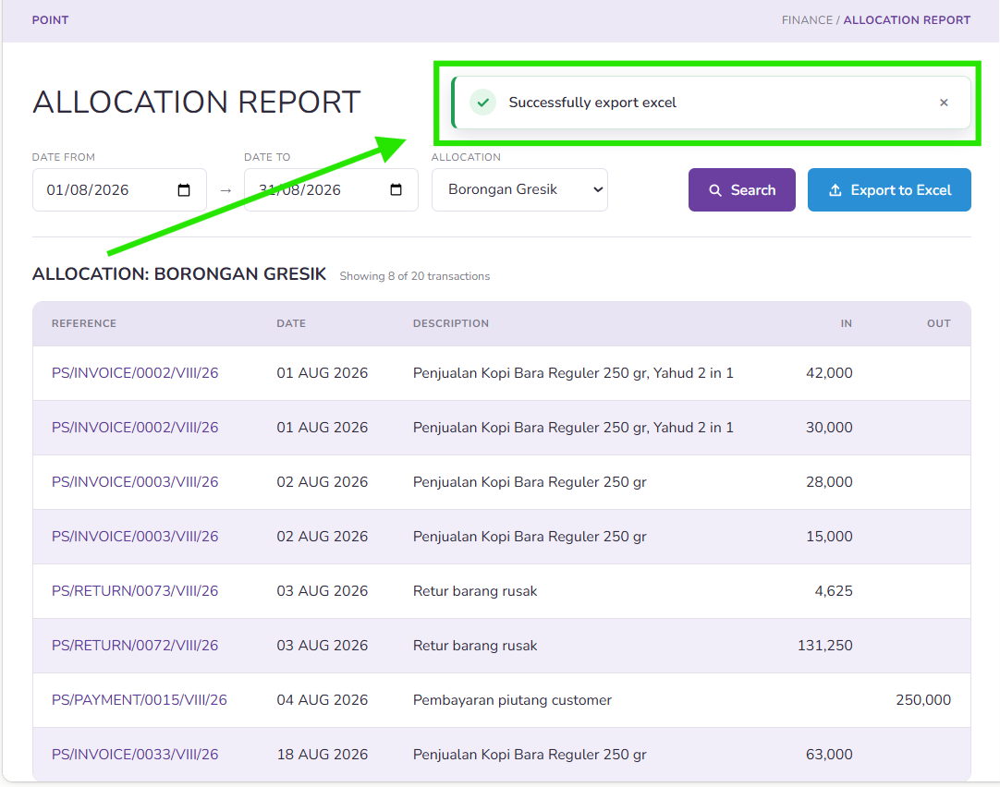

# Export Allocation Report

EE1: System saves
&#x20;export in Excel format
----------------------------

* Given I already logged in
* And I have permission to read allocation report &#x20;
* When I type "/finance/point/allocation-report" into browser
* And I select "01-08-2026" into column date from&#x20;

<figure><figcaption></figcaption></figure>

* And I select "22-08-2019" into column date to&#x20;

<figure><figcaption></figcaption></figure>

* And I select "Retail Surabaya Pusat" into column allocation

<figure><figcaption></figcaption></figure>

* And I click search&#x20;

<figure><figcaption></figcaption></figure>

* And I click export to excel&#x20;

<figure><figcaption></figcaption></figure>

* Then the system can save allocation report as a excel format
  * [Format export](https://docs.google.com/spreadsheets/d/1ORvDKFifHjjMbnNCixJnTjawEhs_5Hlxg8xSFoQe4Zo/edit?usp=sharing)
* And I can see notification "successfully export excel "

<figure><figcaption></figcaption></figure>
