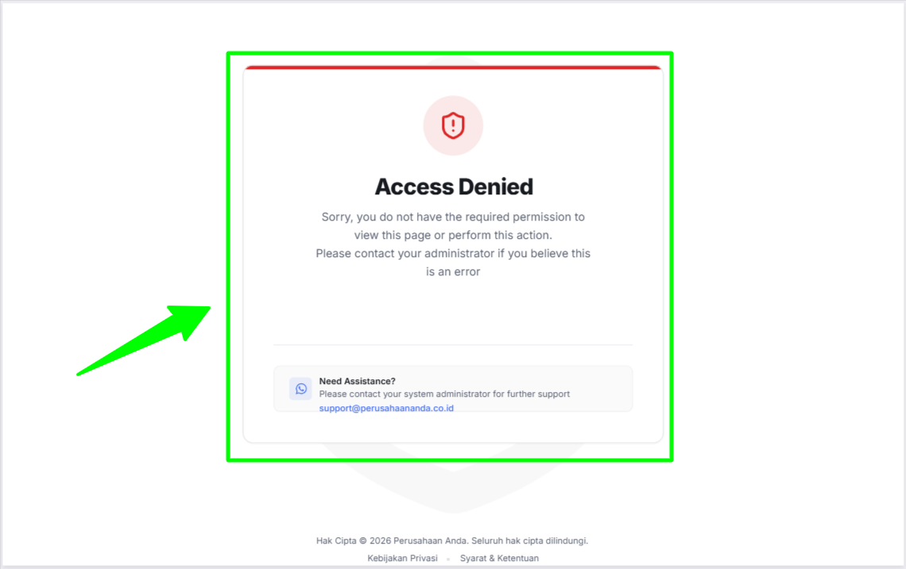

# 10.3 List Cash out

10.3.1: User redirect
&#x20;to login page
-------------------

* Given I have not logged in
* When I type `/finance/point/cash/out/1`  into browser&#x20;
* Then I should be redirected to the login page

<figure><figcaption></figcaption></figure>

10.3.2
: User redirect
&#x20;to forbidden page
-----------------------

* Given I already logged in
* And I do not have permission to view cash out list
* When I type `/finance/point/cash/out/1` into browser&#x20;
* Then I should be redirected to the forbidden page

<figure><figcaption></figcaption></figure>

10.3.3
: Displays list
&#x20;of entered cash-out data
------------------------------

* Given I already logged in
* And I have permission to view cash out list
* When I type `/finance/point/cash/out` into browser&#x20;
* Then I should see the list of entered cash out data&#x20;

<figure><figcaption></figcaption></figure>
